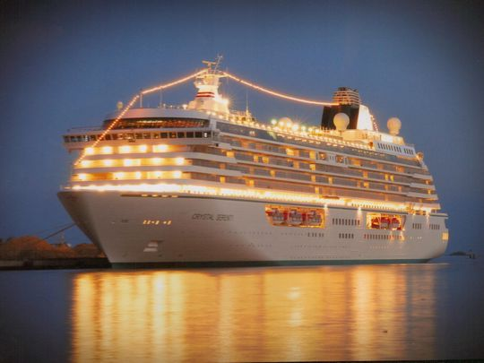

### Cruise Ship Project:
**This** [project](https://github.com/fvgras/cruise-ship-proj/) **is based on Jupyter Notebooks and contains the** [data.world](https://data.world) **dataset with ship locations from 2003 to mid 2017, with additional city and ship information. This is the capstone Data Science project I selected to reflect different modeling predictions.**

- 

```markdown
```
### Final References page:-) |---> [next page](./reference.md) 
